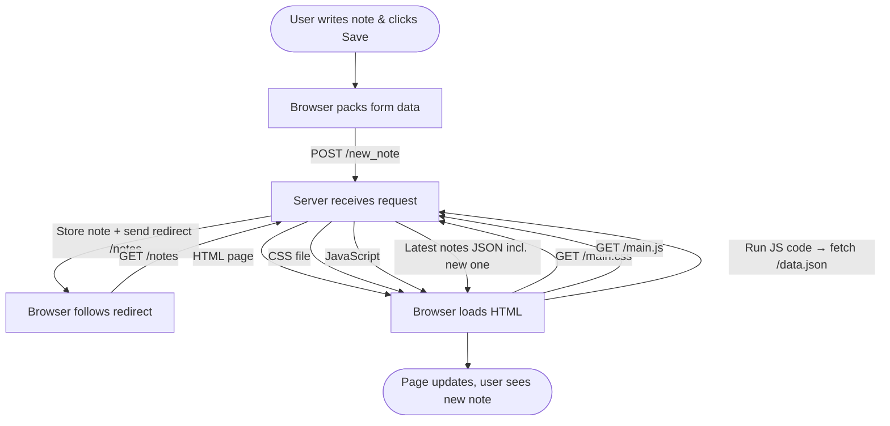

# New note diagram

```mermaid
flowchart TD
    U([User writes note & clicks Save]) --> B1[Browser packs form data]
    B1 -->|POST /new_note| S[Server receives request]
    S -->|Store note + send redirect /notes| B2[Browser follows redirect]

    B2 -->|GET /notes| S
    S -->|HTML page| B3[Browser loads HTML]

    B3 -->|GET /main.css| S
    S -->|CSS file| B3

    B3 -->|GET /main.js| S
    S -->|JavaScript| B3

    B3 -->|Run JS code → fetch /data.json| S
    S -->|Latest notes JSON incl. new one| B3

    B3 --> U2([Page updates, user sees new note])
```
